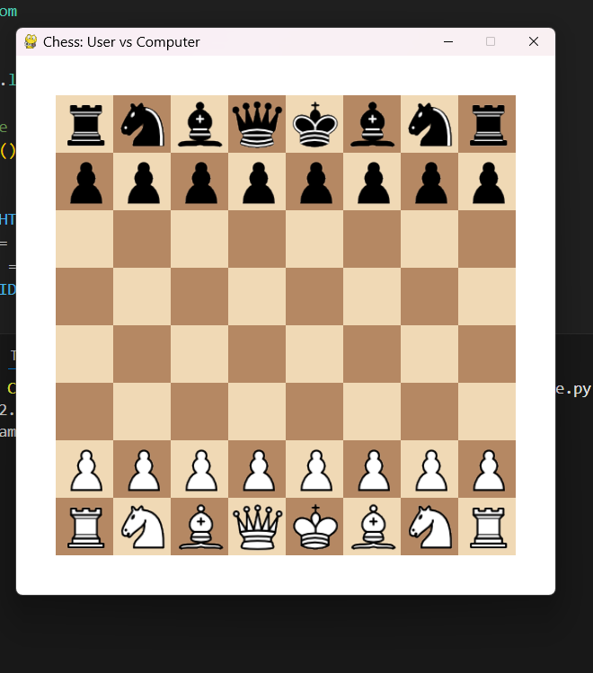
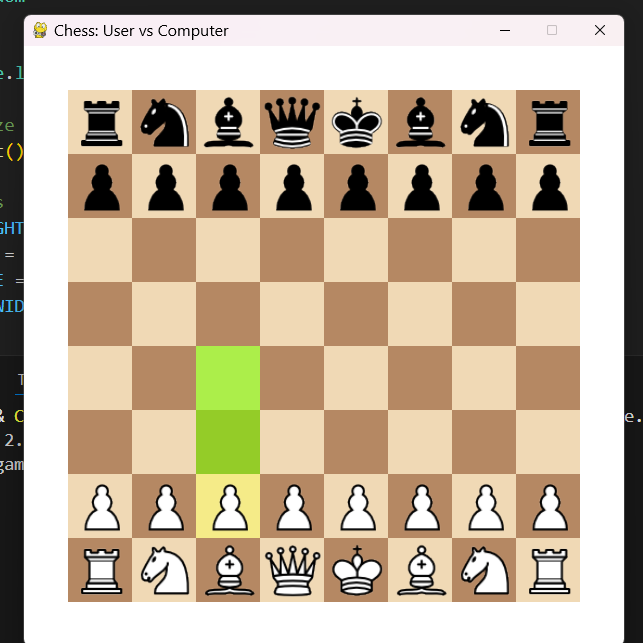

♟️ Chess: User vs Computer (Python, Pygame & python-chess)
This project is a lightweight graphical chess game developed using Python, Pygame, and python-chess. The user plays as White, while a basic AI opponent plays as Black. Designed for casual gameplay and educational purposes, the application showcases how rule-based logic and GUI development can create an interactive chess experience.

🧠 Artificial Intelligence Logic
The computer opponent utilizes a simple decision-making process based on the following priorities:

Safe Captures: Attempts to capture opponent pieces without immediate material loss.

Checks: If no safe captures are available, it looks for moves that check the player's king.

Fallback: If neither is possible, it performs the first available legal move.

Note: This is not a full chess engine like Stockfish. The logic is intentionally simplified to highlight turn-based control flow and rule validation.

🛠️ Requirements
Before running the application, ensure the following dependencies are installed:

bash
Copy
Edit
pip install pygame python-chess
Python 3.7 or higher

Pygame (for rendering and input)

python-chess (for board representation and move legality)

▶️ Getting Started
Clone or download this repository to your local machine.

Ensure that the image/ folder contains the necessary chess piece images, named as follows:

Copy
Edit
wp.png  bp.png
wr.png  br.png
wn.png  bn.png
wb.png  bb.png
wq.png  bq.png
wk.png  bk.png
Launch the game using:

bash
Copy
Edit
python chess_game.py
🎮 Controls and Gameplay Instructions
Use the left mouse button to select and move White pieces.

Legal moves for the selected piece are highlighted in green.

The selected piece is highlighted in yellow.

The AI (Black) will automatically respond after your move.

Press R at any time to restart the game.

The game concludes under standard chess conditions:

Checkmate

Stalemate

Draw (75-move rule, repetition, or insufficient material)

📁 Recommended Folder Structure
markdown
AI-Games/
├── chess/
│   ├── image/                  
│   │   ├── wp.png
│   │   ├── bp.png
│   │   ├── wr.png
│   │   ├── br.png
│   │   ├── wn.png
│   │   ├── bn.png
│   │   ├── wb.png
│   │   ├── bb.png
│   │   ├── wq.png
│   │   ├── bq.png
│   │   ├── wk.png
│   │   └── bk.png
│   │
│   ├── screenshots/         
│   │   ├──start_game.png
│   │   ├── piece_selected.png
│   │   
│   │
│   ├── chess_game.py          
│   └── README.md              

🖼️ Screenshots
📸 Save screenshots of the game during play and place them in the screenshots/ directory.

To embed images in your README:

markdown
Copy
Edit

🚀 Key Features
Interactive 8x8 chessboard using Pygame

Legal move highlights and move validation via python-chess

Automatic promotion to queen for pawns

Game status messaging (e.g., Check, Checkmate)

Basic AI opponent logic for solo practice

🔮 Future Enhancements (Suggestions)
Option to play as Black

Move history panel with PGN export

Sound effects for moves and captures

Undo/Redo functionality

Stronger AI via Minimax or UCI engine integration

Custom promotion dialog (Q/R/B/N)

📜 License
This project is licensed under the MIT License. You are free to modify, distribute, and use it in your own projects.

💡 Credits
Developed using Pygame and python-chess

Chess piece images sourced from open resources such as Wikimedia Commons

