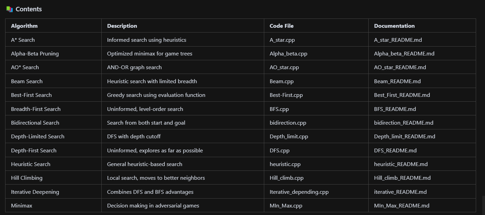

Algorithm Implementation

Welcome to the Algorithm Implementation section of the AI Course!
This directory contains C++ implementations and documentation for a variety of classic and modern search algorithms used in Artificial Intelligence. Each algorithm is accompanied by a dedicated README file explaining its logic, use-cases, and complexity.

How to Use
Each algorithm has:
A C++ implementation (.cpp)
A detailed README (\_README.md) explaining:
Algorithm overview
Step-by-step logic
Time and space complexity
Example input/output
Visual illustrations (where available)
To run an algorithm:
Open the corresponding .cpp file in your C++ environment.
Compile and execute as per your compiler instructions.

🖼️ Visuals
Some algorithms include images and diagrams for better understanding.
Check the images/ folder and the respective README files for visual aids.

🤖 About the Algorithms
Uninformed Search: BFS, DFS, Depth-Limited, Iterative Deepening, Bidirectional
Informed Search: A, Best-First, Beam, Heuristic, Hill Climbing, AO
Game Algorithms: Minimax, Alpha-Beta Pruning
Each algorithm is implemented with clarity and educational value in mind, making this directory a great resource for learning and reference.

📄 References
Artificial Intelligence: A Modern Approach
GeeksforGeeks - Search Algorithms
Wikipedia - List of Search Algorithms

👨‍💻 Contributions
Feel free to contribute improvements, optimizations, or additional algorithms!
Open an issue or submit a pull request.

